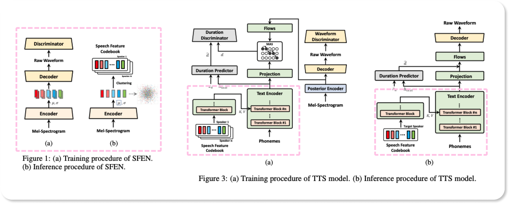

# Loro

**아나운서 준비생을 위한 맞춤형 AI 스피치 연습 애플리케이션, Loro(로로)** 입니다.

현재 대한민국에 존재하는 대부분의 아나운서 학원은 높은 등록비와 수업료를 요구합니다. 이로 인해 경제적으로 부담이 있는 학생들은 학원 수강을 포기하거나, 부모님의 경제력에 따라 선택을 할 수밖에 없는 경우도 있습니다.

또한 대부분의 아나운서 학원은 대도시나 번화가에 위치해 있는 것으로 확인할 수 있었습니다. 지방이나 외곽 지역 거주자들에게 학원까지 이동하는데 추가적인 교통비와 시간이 소요되기에 접근성이 떨어집니다.

따라서 저희는 앱을 통해 **비용적, 지리적 부담 없이 언제, 어디서나 아나운서의 발성을 연습하고 피드백** 받을 수 있도록 하고자 합니다.

이때 **사용자의 음성을 기반으로 한 아나운서 억양 개인화 TTS 모델**을 만들어 이를 바탕으로 실제 학원에서 배우는 것과 유사하게 발성을 연습하고 피드백 받을 수 있습니다.

 
 
 

## General Intro

- 프로젝트 지속기간 : 2024.02 ~ 2024.05
- 배포 링크 : 
- 시연 영상 : [https://www.youtube.com/watch?v=Qv_xKFkwHUQ](https://www.youtube.com/watch?v=Qv_xKFkwHUQ)

 
 
 

## Feature Description

  

📃 **예시 대본 제공 및 사용자 대본 생성 지원**  

사용자가 연습할 수 있는 다양한 예시 대본을 제공합니다. 또한 사용자가 직접 대본을
업로드하거나 실시간으로 원하는 대본을 생성할 수 있는 기능도 제공합니다.
  

👩🏻‍💼 **'아나운서'라는 직업적 특성을 반영한 연습 방법**  

문장단위 연습에서는 한 문장씩 꼼꼼히 발성을 연습할 수 있습니다. 충분한 연습 후 대본에
익숙해지면, 실제 방송 환경처럼 구성한 프롬프터 화면을 이용한 연습을 진행할 수 있습니다.
  

🎧 **사용자 맞춤형 음성 가이드 제공**  

개인화 TTS 모델을 이용해 사용자의 목소리와 아나운서의 특성을 반영한 맞춤형 음성
가이드를 제공합니다. 이를 통해 사용자는 가이드 음성에 맞춰 발음, 억양 등을 개선할 수
있습니다.
  

💯 **실시간 정확도 피드백 제공**  

STT 모델을 활용해 사용자의 발음과 억양에 대한 실시간 피드백을 제공하여
학습 효과를 극대화할 수 있습니다.
  

📈 **프롬프트 연습 정확도 추이 그래프 제공**  

프롬프트 연습 결과를 자동으로 저장해 정확도 추이 그래프를 제공합니다. 사용자는 자신의 성장 추세를 한눈에 확인할 수 있습니다.

 
 
 

## Poster

 
 
 

## Architecture

 
 
 

## Model

 

Loro는 **사용자의 음성 특성을 반영한 가이드 음성을 제공**합니다. 

화자의 음성 특성을 반영하기 위해서 speech feature를 인코딩하고, 이를 음성 합성 모델인 VITS2에 conditioning하여 가이드 음성을 생성합니다. 
  

### SFEN : Speech Feature Encoding Network

화자의 음성은 콘텐츠에 따라 음색과 운율이 매우 다르게 표현될 수 있기 때문에, SFEN은 화자의 음성을 작은 단위로 분할해서 분포에 매핑시킨 후, 이러한 음성 특징들을 클러스터링 하여 이산화된 대표 지점을 얻습니다. 이러한 클러스터의 센트로이드들로 speech feature codebook을 만들어 화자의 전반적인 음성 특성을 모델링합니다.

참고 논문 : [Encoding Speaker-Specific Latent Speech Feature for Speech Synthesis](https://arxiv.org/abs/2311.11745)

- Variational AutoEncoder
- HiFi-GAN
- K-means++ Clustering

 

### VITS2 : Text-to-Speech

SFEN에서 만들어진 화자의 speech feature codebook을 텍스트 인코더의 세 번째 트랜스포머 블록에서 화자 벡터에 conditioning합니다. 이러한 특징은 유한 개수의 비연속 벡터입니다. 그러나 이러한 벡터들은 음성 합성 모델에 조건을 걸 때 query 및 key로서 VITS2의 text encoder의 intermediate feature와 Multi-head Attention을 통해 선형 결합되어 연속 공간에서 점을 샘플링하는 것과 유사한 효과를 낳습니다.

참고 논문 : [VITS2: Improving Quality and Efficiency of Single-Stage Text-to-Speech with Adversarial Learning and Architecture Design](https://arxiv.org/abs/2307.16430)

 

❗**그림에서 점선 박스 내에 있는 부분을 직접 구현하였습니다.**

 
 
 

## Technologies

Project is created with:

|                             | NAME                                                                                                   |
| --------------------------- | ------------------------------------------------------------------------------------------------------ |
| Language                    | `Dart` `Python`                                                                                        |
| Speech Processing Libraries | `librosa` `jamo` `phonemizer` `unidecode` `g2pk` `kiwipiepy` `whisper-jax` `espeakng` `scipy`          |
| Framework                   | `Flutter`  `FastAPI`  `Pytorch` `LangChain`                                                            |
| Cloud Services              | `Firebase`  `Amazon EC2` `AWS S3`                                                                      |
| Design Tools                | `Figma` `Adobe Illustrator`                                                                            |
| Project Document Management | `Jira` `Confluence` `Wakatime`                                                                         |
| IDE                         | `VScode` `Pycharm` `Android Studio`                                                                    |
| Collaboration Tools         | `Discord`                                                                                              |

   

## Developers

|  |  |  |  |
| ------------------------------------------------------------------------------------------------------------- | ----------------------------------------------------------------------------------------------------------- | ------------------------------------------------------------------------------------------------------------ | ------------------------------------------------------------------------------------------------------------- |
| 안지원                                                                                                        | 신민경                                                                                                      | 윤하은                                                                                                       | 김필모                                                                                                        |
| Leader, Backend                                                                                               | Frontend                                                                                                    | AI                                                                                                           | AI                                                                                                            |

   

## Resources

- [중간 보고서](./docs/resources/cd_midterm-report.docx)
- [중간 발표](./docs/resources/cd_midterm_ppt.pdf)
- [최종 발표](./docs/resources/capstone-08-final-pt.pdf)
- [수행결과보고서](./docs/resources/capstone-08-final-report.pdf)
- [포스터](./docs/resources/capstone-08-final-poster.svg)
